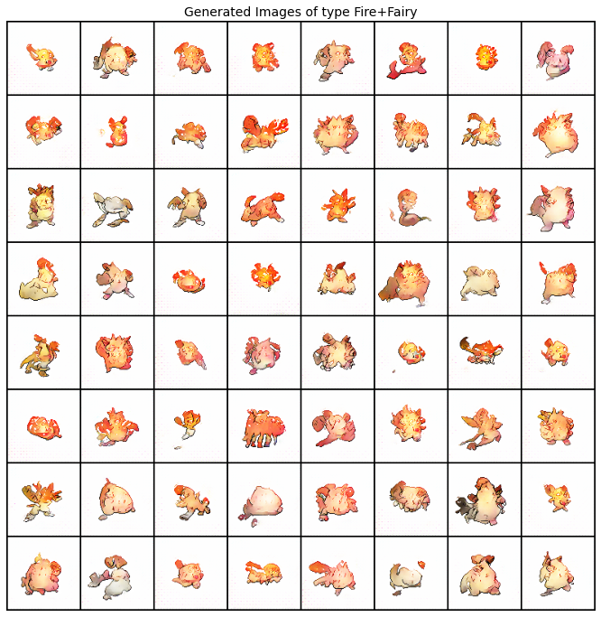
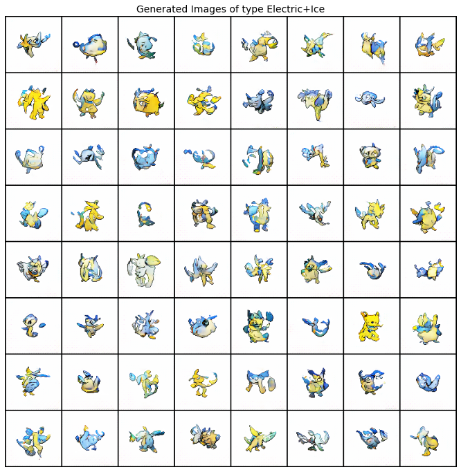
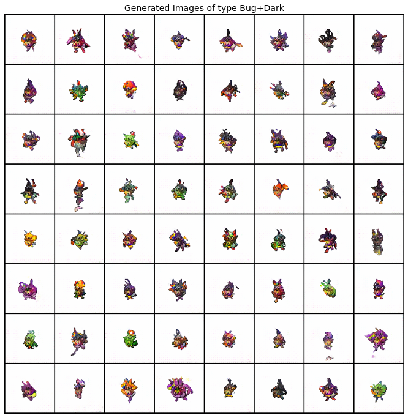

# PokeTypeGAN
Generating new Pokemon with specified type combinations, based on ACGAN + DiffAugment + D2DCE.

## Dataset

The used dataset can be downloaded from: [pokemon_images.zip](https://drive.google.com/file/d/1ZNBuTgFPD007Yvqq1GwrfwccFYdnLP2M/view?usp=sharing), with total 10,437 Pokemon sprites (half of them are shiny variants) in 96x96 resolution collected from 898 Pokemon in different games. Below are the collected images of Bulbaraur:

| Gen3 E                                                       | Gen3 E (Frame 2)                                             | Gen3 FL                                                      | Gen4 DP                                                      |
| ------------------------------------------------------------ | ------------------------------------------------------------ | ------------------------------------------------------------ | ------------------------------------------------------------ |
|  |  |  |  |

| Gen4 HS                                                      | Gen4 HS (Frame 2)                                            | Gen5                                                         | Gen5 (Back)                                                  |
| ------------------------------------------------------------ | ------------------------------------------------------------ | ------------------------------------------------------------ | ------------------------------------------------------------ |
|  |  |  |  |

Labels that may relate to Pokemon’s appearance are extracted from PokeIndex and stored as a CSV file. Below is the sample entry of Bulbasaur:
| **name**  | **pokedex_id** | **type1** | **type2** | **primary_color** | **shape** | **legendary** | **mega_evolution** | **alolan_form** | **galarian_form** | **gigantamax** |
| --------- | -------------- | --------- | --------- | ----------------- | --------- | ------------- | ------------------ | --------------- | ----------------- | -------------- |
| Bulbasaur | 1              | Grass     | Poison    | Green             | Quadruped | FALSE         | FALSE              | FALSE           | FALSE             | FALSE          |

In this repository only the type labels are used. Of course we can also try generating new Pokemon conditioned on other labels.

## Training and Testing

The notebook is self-contained and ran on Google Colab. Just modify those Colab-specific codes and Google Drive specific paths to run locally.

## Sample Generated Images and Model Weights

Sample generated images of all possible (either one or two, in total 171) type combinations are provided in `gen_results/`, and the used model weights is provided in `checkpoints/`. 

For example, let’s create some fire fairies:

and some electric ice-mon:

and some dark bugs (that we programmers hate):

